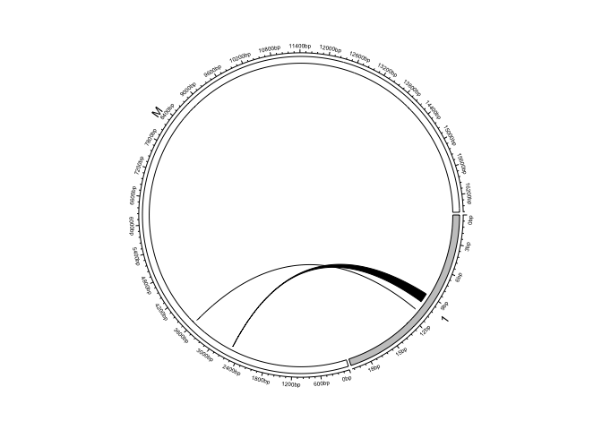

<!-- README.md is generated from README.Rmd. Please do not edit this file directly. -->

# svaNUMT: R package for NUMT detection using structural variant calls

<!-- badges: start -->

[](https://www.gnu.org/licenses/gpl-3.0)

<!-- badges: end -->

`svaNUMT` contains functions for detecting NUMT events from structural
variant calls. It takes structural variant calls in GRanges of breakend
notation and identifies NUMTs by nuclear-mitochondrial breakend
junctions. The main function reports candidate NUMTs if there is a pair
of valid insertion sites found on the nuclear genome within a certain
distance threshold. The candidate NUMTs are reported by events.

This package uses a breakend-centric event notation adopted from the
[`StructuralVariantAnnotation`](https://www.bioconductor.org/packages/release/bioc/html/StructuralVariantAnnotation.html)
package. More information about `VCF` objects and breakend-centric
GRanges object can be found by consulting the vignettes in the
corresponding packages with `browseVignettes("VariantAnnotation")` and
`browseVignettes("StructuralVariantAnnotation")`.

# Installation

[svaNUMT](https://bioconductor.org/packages/svaNUMT) is currently
available for download in the ‘Devel’ version of Bioconductor:

``` r
# install.packages("BiocManager")
BiocManager::install("svaNUMT")
```

The development version can be installed from GitHub:

``` r
BiocManager::install("PapenfussLab/svaNUMT")
```

# Workflow

Below is a workflow example for detecting NUMTs from a simulated human
genome sample. This example is taken from the vignette of
[svaNUMT](https://bioconductor.org/packages/svaNUMT).

## Loading data from VCF

VCF data is parsed into a `VCF` object using the `readVCF` function from
the Bioconductor package `VariantAnnotation`. The `VCF` object is then
converted to a `GRanges` object with breakend-centric notations using
`StructuralVariantAnnotation`.

``` r
library(StructuralVariantAnnotation)
library(VariantAnnotation)
library(svaNUMT)

vcf <- readVcf(system.file("extdata", "chr1_numt_pe_HS25.sv.vcf", package = "svaNUMT"))
gr <- breakpointRanges(vcf)
```

Note that `StructuralVariantAnnotation` requires the `GRanges` object to
be composed entirely of valid breakpoints. Please consult the vignette
of the `StructuralVariantAnnotation` package for ensuring breakpoint
consistency.

## Identifying Nuclear-mitochondrial Genome Fusion Events

Function `svaNUMT` searches for NUMT events by identifying breakends
supporting the fusion of nuclear chromosome and mitochondrial genome.
`svaNUMT` returns identified breakends supporting candidate NUMTs in 2
lists of list of GRanges, grouped by chromosome and insertion sites.

``` r
NUMT <- numtDetect(gr, max_ins_dist = 20)
```

The breakends supporting the insertion sites and the MT sequence are
arranged by the order of events. Below is an example of a detected NUMT
event, where MT sequence `MT:15737-15836` followed by polyadenylation is
inserted between `chr1:1688363-1688364`.

``` r
GRangesList(NU=NUMT$NU$`1`[[1]], MT=NUMT$MT$`1`[[1]])
#> GRangesList object of length 2:
#> $NU
#> GRanges object with 2 ranges and 12 metadata columns:
#>                seqnames    ranges strand | paramRangeID         REF
#>                   <Rle> <IRanges>  <Rle> |     <factor> <character>
#>   gridss1fb_4o        1   1688363      + |           NA           C
#>   gridss1bf_1o        1   1688364      - |           NA           C
#>                                     ALT      QUAL      FILTER     sourceId
#>                             <character> <numeric> <character>  <character>
#>   gridss1fb_4o              C[MT:15737[   3928.49        PASS gridss1fb_4o
#>   gridss1bf_1o ]MT:15836]AAAAAAAAAAAAAC   3581.13        PASS gridss1bf_1o
#>                     partner      svtype     svLen        insSeq    insLen
#>                 <character> <character> <numeric>   <character> <integer>
#>   gridss1fb_4o gridss1fb_4h         BND        NA                       0
#>   gridss1bf_1o gridss1bf_1h         BND        NA AAAAAAAAAAAAA        13
#>                   HOMLEN
#>                <numeric>
#>   gridss1fb_4o         0
#>   gridss1bf_1o         0
#>   -------
#>   seqinfo: 86 sequences from an unspecified genome
#> 
#> $MT
#> GRanges object with 2 ranges and 12 metadata columns:
#>                seqnames    ranges strand | paramRangeID         REF
#>                   <Rle> <IRanges>  <Rle> |     <factor> <character>
#>   gridss1fb_4h       MT     15737      - |           NA           G
#>   gridss1bf_1h       MT     15836      + |           NA           A
#>                                      ALT      QUAL      FILTER     sourceId
#>                              <character> <numeric> <character>  <character>
#>   gridss1fb_4h              ]1:1688363]G   3928.49        PASS gridss1fb_4h
#>   gridss1bf_1h AAAAAAAAAAAAAA[1:1688364[   3581.13        PASS gridss1bf_1h
#>                     partner      svtype     svLen        insSeq    insLen
#>                 <character> <character> <numeric>   <character> <integer>
#>   gridss1fb_4h gridss1fb_4o         BND        NA                       0
#>   gridss1bf_1h gridss1bf_1o         BND        NA AAAAAAAAAAAAA        13
#>                   HOMLEN
#>                <numeric>
#>   gridss1fb_4h         0
#>   gridss1bf_1h         0
#>   -------
#>   seqinfo: 86 sequences from an unspecified genome
```

Below is an example to subset the detected NUMTs by a genomic region
given `seqnames`, `start`, and `end`. For region `chr1:1000000-3000000`,
there are 3 NUMTs detected.

``` r
seqnames = 1
start = 1000000
end = 3000000
i <- sapply(NUMT$NU[[seqnames]], function(x) 
  sum(countOverlaps(x, GRanges(seqnames = seqnames, IRanges(start, end))))>0)
list(NU=NUMT$NU[[seqnames]][i], MT=NUMT$MT[[seqnames]][i])
#> $NU
#> $NU[[1]]
#> GRanges object with 2 ranges and 12 metadata columns:
#>                seqnames    ranges strand | paramRangeID         REF
#>                   <Rle> <IRanges>  <Rle> |     <factor> <character>
#>   gridss1fb_4o        1   1688363      + |           NA           C
#>   gridss1bf_1o        1   1688364      - |           NA           C
#>                                     ALT      QUAL      FILTER     sourceId
#>                             <character> <numeric> <character>  <character>
#>   gridss1fb_4o              C[MT:15737[   3928.49        PASS gridss1fb_4o
#>   gridss1bf_1o ]MT:15836]AAAAAAAAAAAAAC   3581.13        PASS gridss1bf_1o
#>                     partner      svtype     svLen        insSeq    insLen
#>                 <character> <character> <numeric>   <character> <integer>
#>   gridss1fb_4o gridss1fb_4h         BND        NA                       0
#>   gridss1bf_1o gridss1bf_1h         BND        NA AAAAAAAAAAAAA        13
#>                   HOMLEN
#>                <numeric>
#>   gridss1fb_4o         0
#>   gridss1bf_1o         0
#>   -------
#>   seqinfo: 86 sequences from an unspecified genome
#> 
#> $NU[[2]]
#> GRanges object with 2 ranges and 12 metadata columns:
#>                seqnames          ranges strand | paramRangeID         REF
#>                   <Rle>       <IRanges>  <Rle> |     <factor> <character>
#>   gridss1fb_5o        1 1791082-1791083      + |           NA           G
#>   gridss1bf_2o        1         1791084      - |           NA           A
#>                                  ALT      QUAL      FILTER     sourceId
#>                          <character> <numeric> <character>  <character>
#>   gridss1fb_5o            G[MT:2592[   1929.85        PASS gridss1fb_5o
#>   gridss1bf_2o ]MT:3592]AAAAAAAAAAAA   2894.91        PASS gridss1bf_2o
#>                     partner      svtype     svLen      insSeq    insLen
#>                 <character> <character> <numeric> <character> <integer>
#>   gridss1fb_5o gridss1fb_5h         BND        NA                     0
#>   gridss1bf_2o gridss1bf_2h         BND        NA AAAAAAAAAAA        11
#>                   HOMLEN
#>                <numeric>
#>   gridss1fb_5o         1
#>   gridss1bf_2o         0
#>   -------
#>   seqinfo: 86 sequences from an unspecified genome
#> 
#> $NU[[3]]
#> GRanges object with 2 ranges and 12 metadata columns:
#>                seqnames    ranges strand | paramRangeID         REF
#>                   <Rle> <IRanges>  <Rle> |     <factor> <character>
#>   gridss2fb_3o        1   2869079      + |           NA           G
#>   gridss2bf_2o        1   2869080      - |           NA           A
#>                                      ALT      QUAL      FILTER     sourceId
#>                              <character> <numeric> <character>  <character>
#>   gridss2fb_3o                G[MT:2786[   2472.12        PASS gridss2fb_3o
#>   gridss2bf_2o ]MT:2985]AAAAAAAAAAAAAAAA   2456.81        PASS gridss2bf_2o
#>                     partner      svtype     svLen          insSeq    insLen
#>                 <character> <character> <numeric>     <character> <integer>
#>   gridss2fb_3o gridss2fb_3h         BND        NA                         0
#>   gridss2bf_2o gridss2bf_2h         BND        NA AAAAAAAAAAAAAAA        15
#>                   HOMLEN
#>                <numeric>
#>   gridss2fb_3o         0
#>   gridss2bf_2o         0
#>   -------
#>   seqinfo: 86 sequences from an unspecified genome
#> 
#> 
#> $MT
#> $MT[[1]]
#> GRanges object with 2 ranges and 12 metadata columns:
#>                seqnames    ranges strand | paramRangeID         REF
#>                   <Rle> <IRanges>  <Rle> |     <factor> <character>
#>   gridss1fb_4h       MT     15737      - |           NA           G
#>   gridss1bf_1h       MT     15836      + |           NA           A
#>                                      ALT      QUAL      FILTER     sourceId
#>                              <character> <numeric> <character>  <character>
#>   gridss1fb_4h              ]1:1688363]G   3928.49        PASS gridss1fb_4h
#>   gridss1bf_1h AAAAAAAAAAAAAA[1:1688364[   3581.13        PASS gridss1bf_1h
#>                     partner      svtype     svLen        insSeq    insLen
#>                 <character> <character> <numeric>   <character> <integer>
#>   gridss1fb_4h gridss1fb_4o         BND        NA                       0
#>   gridss1bf_1h gridss1bf_1o         BND        NA AAAAAAAAAAAAA        13
#>                   HOMLEN
#>                <numeric>
#>   gridss1fb_4h         0
#>   gridss1bf_1h         0
#>   -------
#>   seqinfo: 86 sequences from an unspecified genome
#> 
#> $MT[[2]]
#> GRanges object with 2 ranges and 12 metadata columns:
#>                seqnames    ranges strand | paramRangeID         REF
#>                   <Rle> <IRanges>  <Rle> |     <factor> <character>
#>   gridss1fb_5h       MT 2592-2593      - |           NA           G
#>   gridss1bf_2h       MT      3592      + |           NA           G
#>                                    ALT      QUAL      FILTER     sourceId
#>                            <character> <numeric> <character>  <character>
#>   gridss1fb_5h            ]1:1791082]G   1929.85        PASS gridss1fb_5h
#>   gridss1bf_2h GAAAAAAAAAAA[1:1791084[   2894.91        PASS gridss1bf_2h
#>                     partner      svtype     svLen      insSeq    insLen
#>                 <character> <character> <numeric> <character> <integer>
#>   gridss1fb_5h gridss1fb_5o         BND        NA                     0
#>   gridss1bf_2h gridss1bf_2o         BND        NA AAAAAAAAAAA        11
#>                   HOMLEN
#>                <numeric>
#>   gridss1fb_5h         1
#>   gridss1bf_2h         0
#>   -------
#>   seqinfo: 86 sequences from an unspecified genome
#> 
#> $MT[[3]]
#> GRanges object with 2 ranges and 12 metadata columns:
#>                seqnames    ranges strand | paramRangeID         REF
#>                   <Rle> <IRanges>  <Rle> |     <factor> <character>
#>   gridss2fb_3h       MT      2786      - |           NA           T
#>   gridss2bf_2h       MT      2985      + |           NA           C
#>                                        ALT      QUAL      FILTER     sourceId
#>                                <character> <numeric> <character>  <character>
#>   gridss2fb_3h                ]1:2869079]T   2472.12        PASS gridss2fb_3h
#>   gridss2bf_2h CAAAAAAAAAAAAAAA[1:2869080[   2456.81        PASS gridss2bf_2h
#>                     partner      svtype     svLen          insSeq    insLen
#>                 <character> <character> <numeric>     <character> <integer>
#>   gridss2fb_3h gridss2fb_3o         BND        NA                         0
#>   gridss2bf_2h gridss2bf_2o         BND        NA AAAAAAAAAAAAAAA        15
#>                   HOMLEN
#>                <numeric>
#>   gridss2fb_3h         0
#>   gridss2bf_2h         0
#>   -------
#>   seqinfo: 86 sequences from an unspecified genome
```

## Visualising breakpoint pairs via circos plots

One way of visualising paired breakpoints is by circos plots. Here we
use the package
[`circlize`](https://doi.org/10.1093/bioinformatics/btu393) to
demonstrate breakpoint visualisation. The `bedpe2circos` function takes
BEDPE-formatted dataframes (see `breakpointgr2bedpe()`) and plotting
parameters for the `circos.initializeWithIdeogram()` and
`circos.genomicLink()` functions from `circlize`.

To generate a simple circos plot of one candidate NUMT event:

``` r
library(circlize)
numt_chr_prefix <- c(NUMT$NU$`1`[[2]], NUMT$MT$`1`[[2]])
GenomeInfoDb::seqlevelsStyle(numt_chr_prefix) <- "UCSC"
pairs <- breakpointgr2pairs(numt_chr_prefix)
pairs
```

To see supporting breakpoints clearly, we generate the circos plot
according to the loci of event.

``` r
circos.initializeWithIdeogram(
    data.frame(V1=c("chr1", "chrM"),
               V2=c(1791073,1),
               V3=c(1791093,16571),
               V4=c("p15.4",NA),
               V5=c("gpos50",NA)),  sector.width = c(0.2, 0.8))
#circos.initializeWithIdeogram()
circos.genomicLink(as.data.frame(S4Vectors::first(pairs)), 
                   as.data.frame(S4Vectors::second(pairs)))
```

<!-- -->

``` r
circos.clear()
```

<!-- # Citation

You can cite `svaNUMT` [here]()

```
@ARTICLE{svaNUMT,
  title    = "",
  author   = "",
  journal  = "",
  volume   = ,
  number   = ,
  pages    = ,
  month    = ,
  year     = ,
  url      = ,
  doi      = ,
  pmc      = 
}
```
-->
